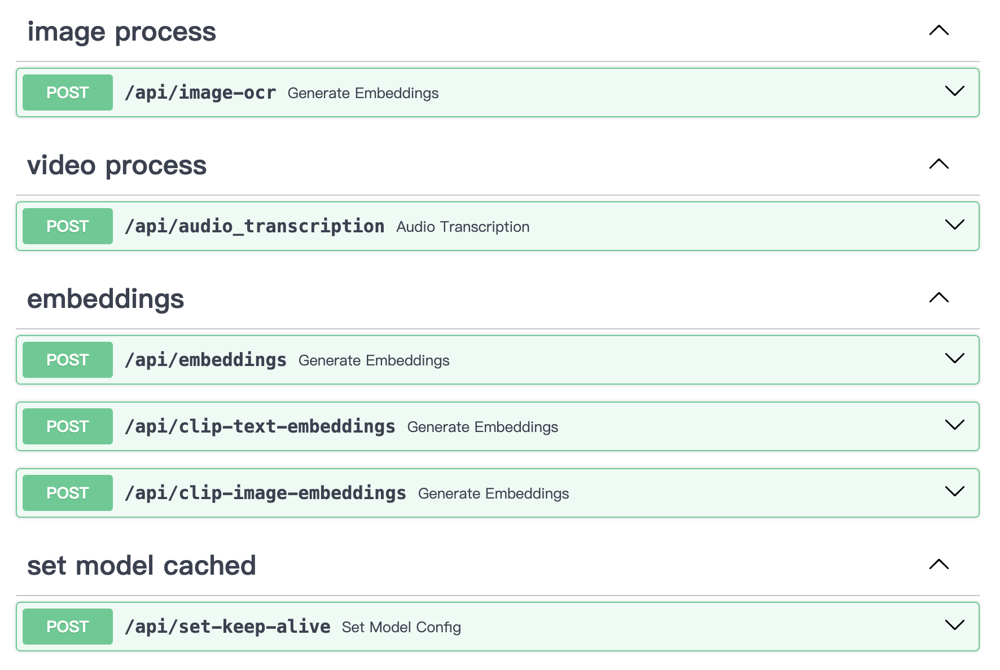

## mm_server Model Service Installation

**English** | [简体中文](./README.zh-CN.md)

#### Environment Installation

You can use[miniconda](https://docs.anaconda.com/free/miniconda/miniconda-install/) for a lightweight installation of the python conda environment.

```bash
# Install the virtual environment
conda create -n qllm python==3.11
source activate qllm

cd mm_server

# Install python dependencies
pip install -r requirements.txt
```

<br/>

#### Modify Configuration File

Edit the model configuration items:

```
cp config.py.local config.py
```

Modify the `config.py` configuration file according to your usage:

clip_model_name: Visual embedding model, text embedding model
ocr_model_path: OCR text recognition model
hf_embedding_model_name: Text embedding model
audio_model_name: Video to text model

```python
@dataclass
class Configer:
    # mm server host
    server_host = "localhost"
    server_port = 50110

    # image encoder model name
    clip_model_name = "ViT-B/32"
    # model keep alive time (s)
    clip_keep_alive = 60

    # ocr model path
    ocr_model_path = str(TEMPLATE_PATH / "services/ocr_server/ocr_models")
    # model keep alive time (s)
    ocr_keep_alive = 60

    # text embedding model name
    hf_embedding_model_name = "BAAI/bge-small-en-v1.5"
    # model keep alive time (s)
    hf_keep_alive = 60

    # video transcription  model name
    audio_model_name = "small"
    # model keep alive time (s)
    video_keep_alive = 1

```

#### Start the Service

```bash
source activate qllm
python main.py

# reload mode, hot update after modifying the code
# uvicorn main:app --reload --host localhost --port 50110
```

<br/>

#### Local Ollama Model Deployment

Refer to the instructions for installing Ollama:

- https://ollama.com/download/mac

**Starting the Local Model**
Choose the 8b local model, though there will be a loss in performance.

```bash
# Local version:
ollama run llama3:8b-instruct-q4_0
```

**(Optional) Local 70B Large Model**
For servers, you can choose the 70b large model version. You also need to modify `model_name` in `mmrag_server/config.py`.

```bash
# Remote server version:
ollama run llama3:70b-instruct
```

**(Optional) Model Lifecycle Management**
Ollama automatically releases the model if it's not used for 5 minutes, and restarts it upon the next access. If you need to keep it loaded for a longer period, you can configure it as follows:

- Duration string (e.g., "10m" or "24h")
- Number in seconds (e.g., 3600)
- Permanently keep the model loaded: any negative number (e.g., -1 or "-1m")
- Unload the model: "0" will unload the model immediately after generating a response

```bash
# Permanently keep the model loaded
curl http://localhost:11434/api/generate -d '{"model": "MODEL_NAME", "keep_alive": -1}'

# Unload the model
curl http://localhost:11434/api/generate -d '{"model": "MODEL_NAME", "keep_alive": 0}'

# Set auto-release time
curl http://localhost:11434/api/generate -d '{"model": "MODEL_NAME", "keep_alive": 3600}'

```

#### Model selection

- long Text Model:[ 524k llama3 Version ](https://ollama.com/pxlksr/llama-3-70b-instruct-gradient-524k)

- High-Quality Open-Source LLM: : [Llama-3-70b-Instruct](https://ollama.com/library/llama3:70b-instruct)
- High-Quality Small Mode: [llama3:8b-instruct](https://ollama.com/library/llama3:8b-instruct-q4_0)

- Text Embedding Model: [bge-small](https://huggingface.co/BAAI/bge-small-en-v1.5)
- Image embedding Model: [CLIP](https://github.com/openai/CLIP)

- llm model selection: [llm Leaderboard](https://chat.lmsys.org/?leaderboard)

<br/>

#### API Documentation:

http://localhost:50110/docs



<!--  -->
<div align="right">

[![][back-to-top]](../README.md)

</div>

[back-to-top]: https://img.shields.io/badge/-BACK_TO_TOP-151515?style=flat-square
